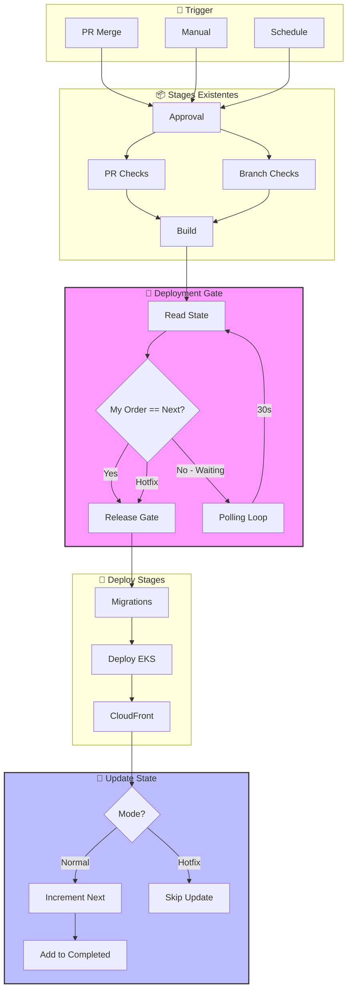
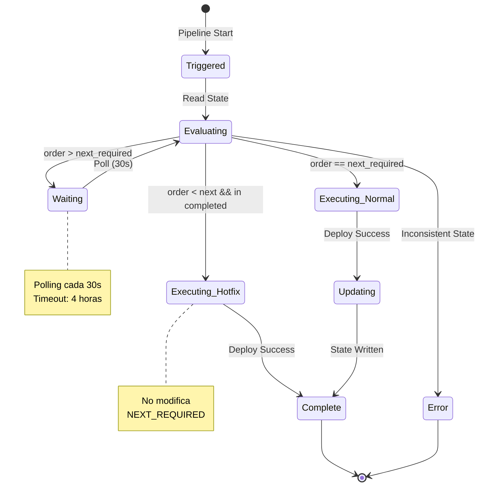
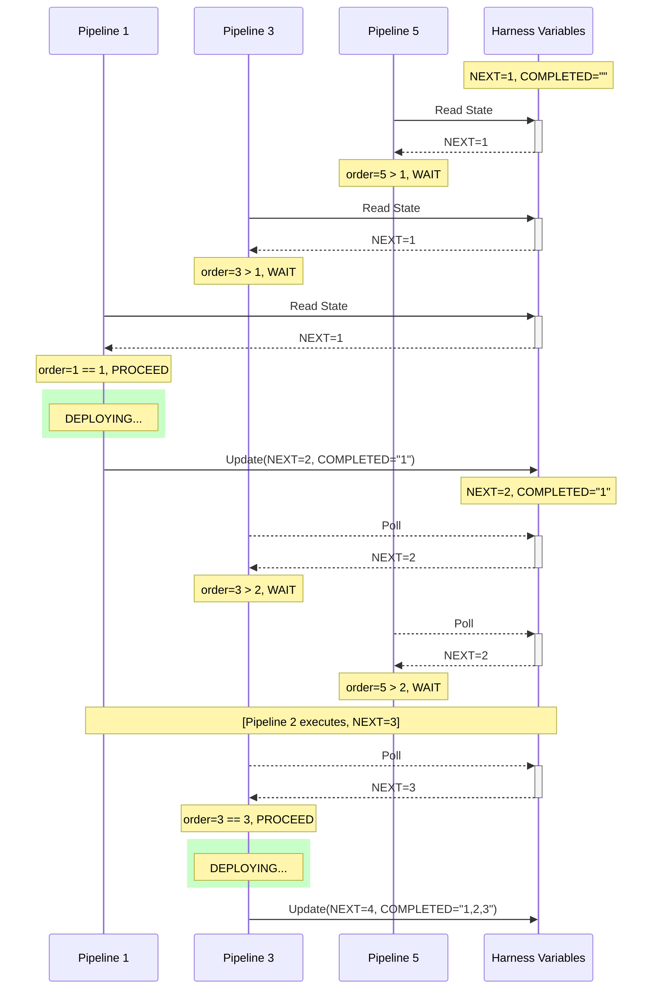
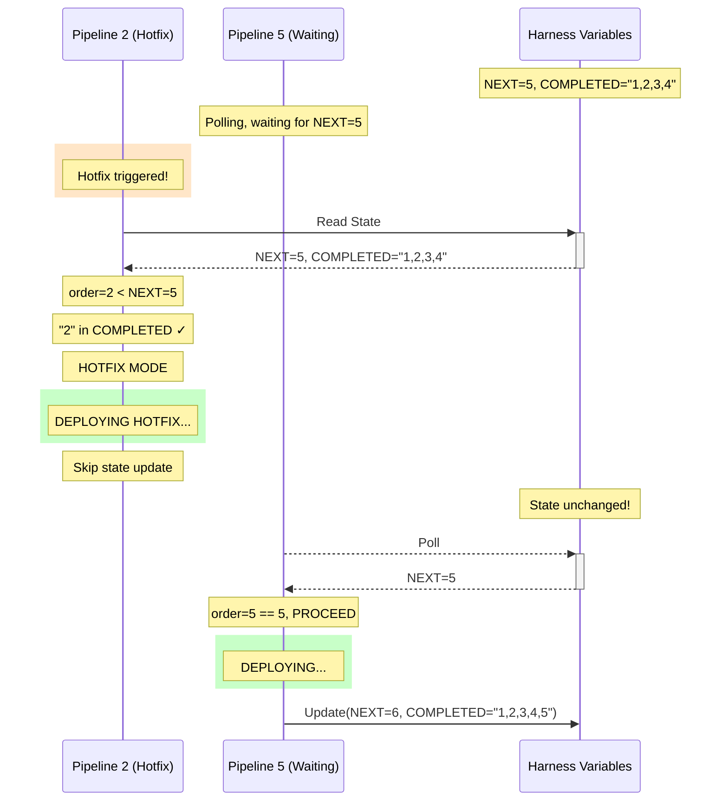
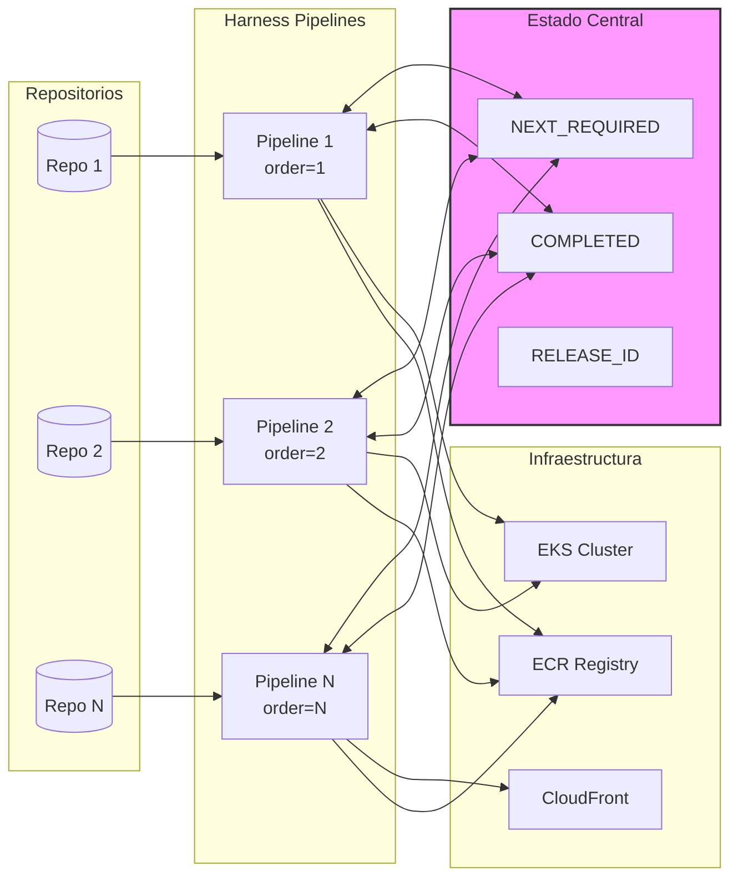
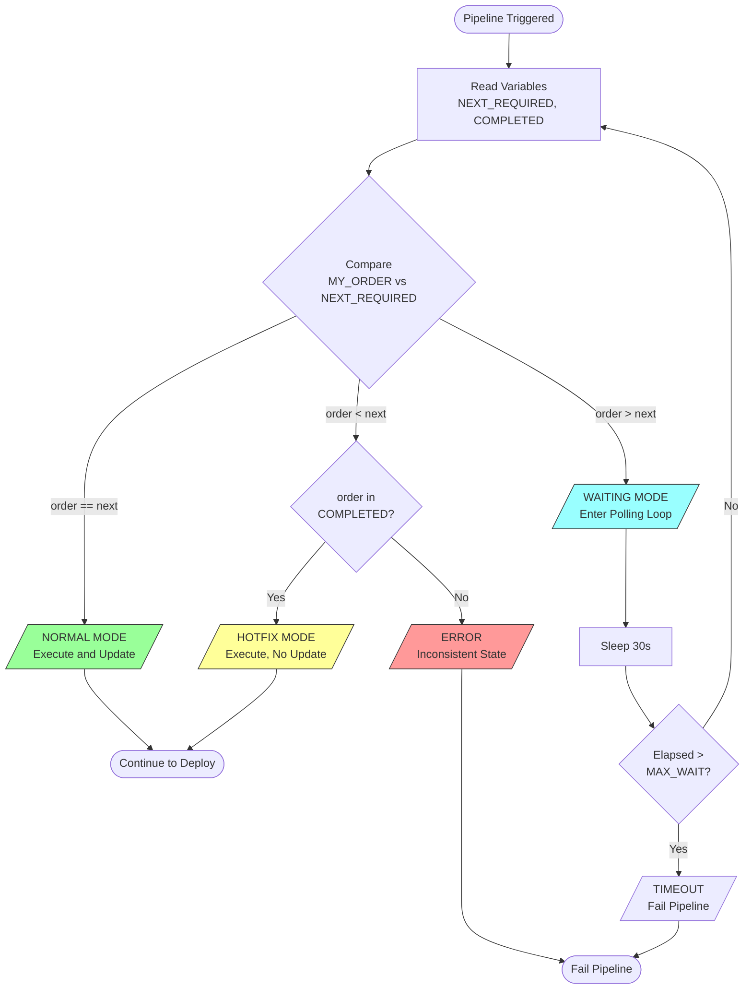
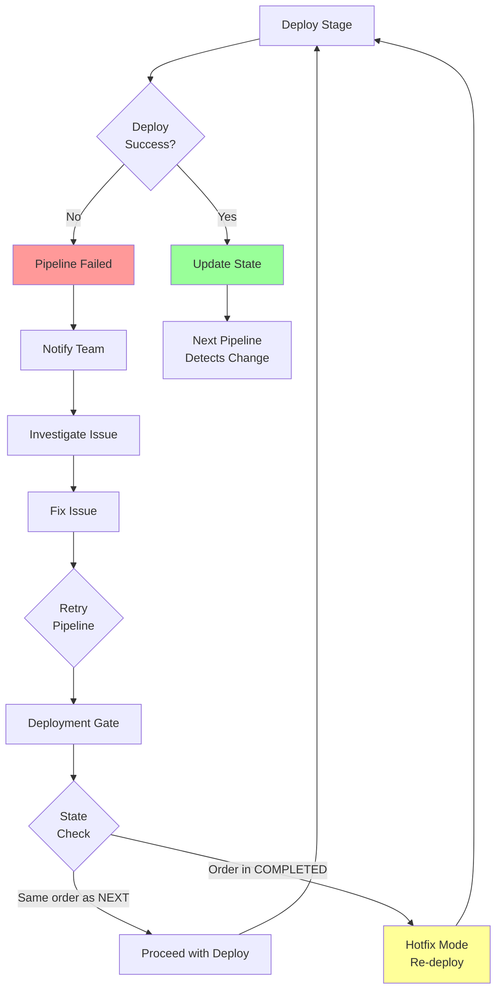

# Diagramas de Arquitectura

## 1. Flujo General de Orquestación

## 2. Máquina de Estados por Servicio

## 3. Secuencia de Release Normal

## 4. Secuencia de Hotfix

## 5. Arquitectura de Componentes

## 6. Flujo de Decisión en Deployment Gate

## 7. Timeline de Release Completo

```mermaid
gantt
    title Release Timeline con Orquestación
    dateFormat  HH:mm
    axisFormat %H:%M

    section Service 1
    Build & Test        :a1, 09:00, 15m
    Deploy Gate (pass)  :a2, after a1, 1m
    Deploy              :a3, after a2, 10m
    Update State        :a4, after a3, 1m

    section Service 2
    Build & Test        :b1, 09:05, 15m
    Deploy Gate (wait)  :b2, after b1, 11m
    Deploy              :b3, after b2, 8m
    Update State        :b4, after b3, 1m

    section Service 3
    Build & Test        :c1, 09:10, 15m
    Deploy Gate (wait)  :c2, after c1, 20m
    Deploy              :c3, after c2, 12m
    Update State        :c4, after c3, 1m

    section Service 5
    Build & Test        :d1, 09:00, 20m
    Deploy Gate (wait)  :d2, after d1, 45m
    Deploy              :d3, after d2, 10m
    Update State        :d4, after d3, 1m
```

## 8. Flujo de Error y Recovery

